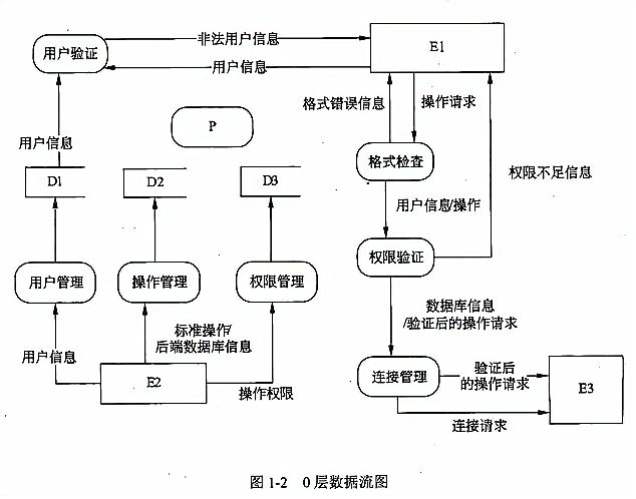
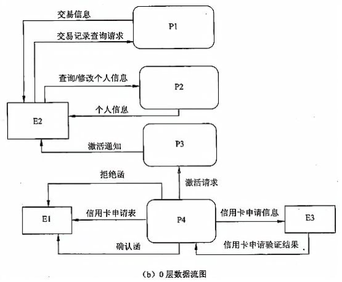

# 

某大型企业的数据中心为了集中管理、控制用户对数据的访问并支持大量的连接需求，欲构建数据管理中间件，其主要功能如下：

(1)数据管理员可通过中间件进行用户管理、操作管理和权限管理。用户管理维护用户信息，用户信息(用户名、密码)存储在用户表中：操作管理维护数据实体的标准操作及其所属的后端数据库信息，标准操作和后端数据库信息存放在操作表中：权限管理维护权限表，该表存储用户可执行的操作信息。

(2)中间件验证前端应用提供的用户信息。若验证不通过，返回非法用户信息；若验证通过，中间件将等待前端应用提交操作请求。

(3)前端应用提交操作请求后，中间件先对请求进行格式检查。如果格式不正确，返回格式错误信息；如果格式正确，则进行权限验证(验证用户是否有权执行请求的操作)，若用户无权执行该操作，则返回权限不足信息，否则进行连接管理。

(4)连接管理连接相应的后台数据库并提交操作，连接管理先检查是否存在空闲的数据库连接，如果不存在，新建连接；如果存在，则重用连接。

(5)后端数据库执行操作并将结果传给中间件，中间件对收到的操作结果进行处理后，将其返回给前端应用。

现采用结构化方法对系统进行分析与设计，获得如图 1-1 所示的顶层数据流图和图 1-2所示的 0 层数据流图。

【问题： 1.1 】使用说明中的词语，给出图 1-1 中的实体 E1 〜 E3 的名称。

【问题： 1.2 】使用说明中的词语，给出图 1-2 中的数据存储 D1 〜 D3 的名称。

【问题： 1.3 】给出图 1-2 中加工 P 的名称及其输入、输出流。

除加工 P的输入与输出流外，图1-2 还缺失了两条数据流，请给出这两条数据流的起点和终点。

【问题： 1.4 】在绘制数据流图时，需要注意加工的绘制。请给出三种在绘制加工的输入、输出时可能出现的错误。

# 

现准备为某银行开发一个信用卡管理系统 CCMS,该系统的基本功能为：

1.信用卡申请。非信用卡客户填写信用卡申请表，说明所要申请的信用卡类型及申请者的基本信息，提交 CCMS。如果信用卡申请被银行接受， CCMS将记录该客户的基本信息，并发送确认函给该客户，告知客户信用卡的有效期及信贷限额；否则该客户将会收到一封拒绝函。非信用卡客户收到确认函后成为信用卡客户。

2.信用卡激活。信用卡客户向CCMS提交激活请求，用信用卡号和密码激活该信用卡。激活操作结束后， CCMS将激活通知发送给客户，告知客户其信用卡是否被成功激活。

3.信用卡客户信息管理。信用卡客户的个人信息可以在 CCMS中进行在线管理。每位信用卡客户可以在线查询和修改个人信息。

4.交易信息查询。信用卡客户使用信用卡进行的每一笔交易都会记录在CCMS 中。信用卡客户可以通过CCMS查询并核实其交易信息(包括信用卡交易记录及交易额)。

下图(a)和(b)分别给出了该系统的顶层数据流图和 0 层数据流图的初稿。

【问题： 1.1 】根据说明，将图(a)中的 E1 〜 E3 填充完整。

【问题： 1.2 】图(a)中缺少三条数据流，根据说明，分别指出这三条数据流的起点和终点。(注：数据流的起点和终点均采用图中的符号和描述)

【问题： 1.3 】图(b)中有两条数据流是错误的，请指出这两条数据流的名称，并改正。
(注：数据流的起点和终点均采用图中的符号和描述)

【问题： 1.4 】根据说明，将图(b)中 P1 〜 P4 的处理名称填充完整。