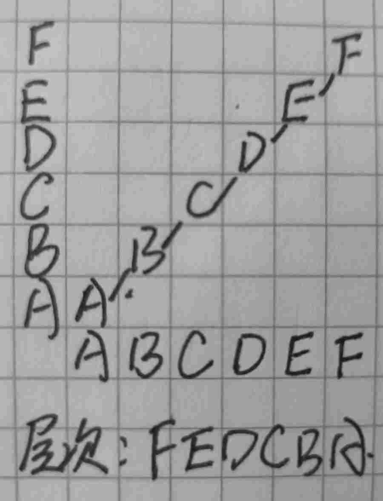
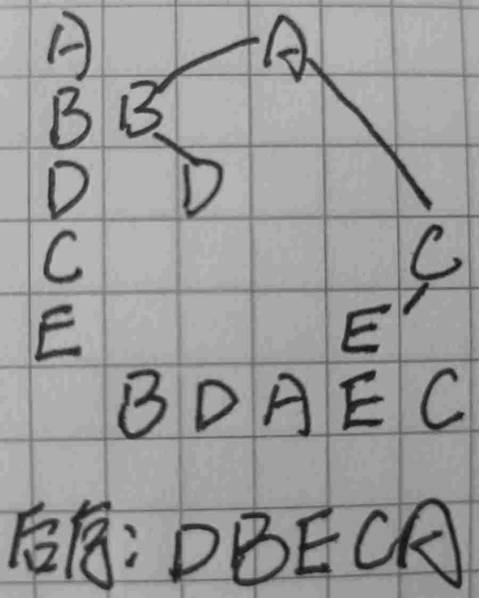
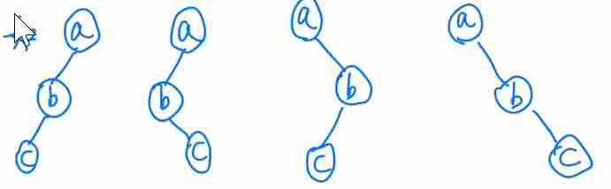

# 二叉树

## 反向构造二叉树

### 中+后：单选题

某二叉树的后序遍历序列与中序遍历序列相同，均为 ABCDEF，则按层次输出（同一层从左到右）的序列（） 。 

【正确答案】：**FEDCBA**

【试题解析】：

 

### 中+先：单选题

已知某二叉树中序遍历序列是 BDAEC，先序遍历序列是 ABDCE，则该二叉树按后序遍历输出位为（ ）。

【正确答案】：**DBECA**

【试题解析】：

### 先+后：单选题

若一棵二叉树的前序遍历序列和后序遍历序列分别为 1，2，3，4 和 4，3，2，1，则该二叉树的中序遍历序列不会是（ ）。 

A.1，2，3，4 

B.2，3，4，1

C.3，2，4，1 

D.4，3，2，1 

【正确答案】：**C**

【试题解析】：

按照条件就可以知道结点 1 在第一层，2 在第二层，3 在第三层，4 在第四层，因此中序遍历 ABD 都有可能出现，但是对于答案 C 而言，如果第一个出现的是 3 结点，该结点就是最左结点，接下来就应该是 4，不会是 2。 

### 先+后：单选题

设二叉树的先序遍历序列和后序遍历序列正好相反，则该二叉树满足的条件是（ ）。 

A.空或只有一个结点

B.高度等于其结点数

C.任一结点无左孩子

D.任一结点无右孩子 

【正确答案】：**B**

【试题解析】：

这样的二叉树每层只有一个结点，高度等于其结点数。

 

### 先+后：简答题

若某非空二叉树的先序序列和后序序列正好相同，则该二叉树的形态是什么？

左右子树都为空，该二叉树只有根节点
